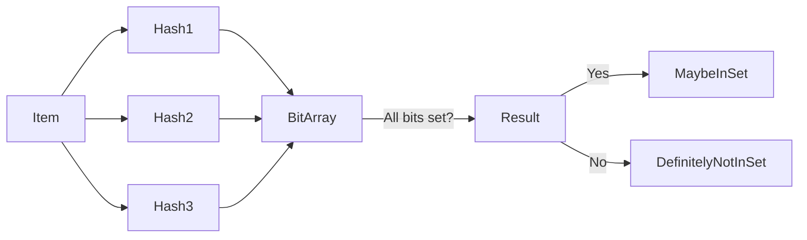
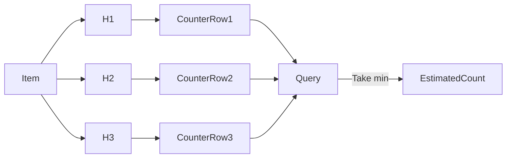

# When “Perfect” Is the Bottleneck

## How Approximate Data Structures Win at Scale

At small scale, correctness is cheap.

At large scale, correctness is **expensive**.

Once your system starts dealing with *billions* of events, users, or keys, the “obvious” solutions quietly turn into resource black holes. A simple `HashSet` that felt elegant in a unit test becomes terabytes of RAM. A precise counter becomes a hot lock. A clean design becomes the reason your system can’t ship.

This is where a certain class of data structures shines—ones that intentionally give up *perfect accuracy* to gain **orders of magnitude** in speed and memory efficiency.

Not hacks.
Not shortcuts.
**Well-studied probabilistic data structures.**

Let’s walk through three of the most practical ones, when they make sense, and—just as importantly—when they don’t.

---

## Approximation Is Not Sloppiness

Before diving in, one important principle:

> Don’t introduce clever data structures to solve imaginary scaling problems.

Most systems don’t need Bloom filters.
Most counters don’t need sketches.
Most analytics don’t need HyperLogLog.

But when you *do* hit real constraints—memory ceilings, network costs, or latency budgets—approximation often beats brute force.

---

## 1. Bloom Filter: Fast Rejection at Almost Zero Cost

### The Problem It Solves

You need to answer one question, extremely fast:

> **“Have I *possibly* seen this before?”**

Common examples:

* URLs already crawled
* Cache keys that definitely don’t exist
* Known-bad inputs
* Duplicate events in ingestion pipelines

Storing every key precisely is expensive.
Bloom filters flip the question around.

---

### How a Bloom Filter Thinks

A Bloom filter:

* Uses a **bit array**
* Applies **multiple hash functions**
* Never produces **false negatives**
* Can produce **false positives**

In other words:

* If it says **“no”**, the answer is *definitely no*
* If it says **“yes”**, the answer is *maybe*

That “maybe” is the price you pay for massive efficiency.

---

### Visual Intuition

Each item sets multiple bits.
Queries check those same bits.

Collisions are allowed. Accuracy is probabilistic.

---

### Why Engineers Actually Use It

* Saves **network hops** in front of caches
* Avoids disk reads for guaranteed misses
* Replaces terabytes of storage with megabytes of RAM

A false positive usually just means *extra work*.
A false negative would mean *data corruption*—which Bloom filters never allow.

---

### When **Not** to Use It

* You need deletions (unless you use a counting Bloom filter)
* False positives are unacceptable
* Memory is not actually constrained

---

## 2. Count-Min Sketch: Counting Without Remembering

### The Problem It Solves

You’re processing a massive stream and want to know:

* Which items appear the most?
* Which IPs are noisy?
* Which queries are hot?

But storing counters for *every* key is impossible.

---

### What the Sketch Guarantees

A Count-Min Sketch:

* Estimates frequencies
* **Never underestimates**
* May overestimate due to collisions
* Uses fixed memory regardless of input size

It gives you an **upper bound**, not an exact number.

---

### How It Works (Conceptually)

Each row is indexed by a different hash function.
When querying, you take the **minimum** of all counters.

Why?

* Collisions inflate counts
* The smallest value is closest to reality

---

### Real-World Usage

* Detecting **heavy hitters**
* Rate limiting
* Traffic analysis
* Telemetry aggregation
* Fraud and anomaly detection

Often paired with:

* A small heap or map of candidate keys
* Periodic resets or windowing

---

### The Catch Most People Miss

The sketch:

* Knows **counts**
* Does **not** know **keys**

You must track the keys separately if you care about them.

This makes it powerful—but very specific.

---

## 3. HyperLogLog: Counting Uniques Without Counting Them

### The Problem It Solves

> “How many *distinct* items have I seen?”

Examples:

* Daily active users
* Unique IPs
* Unique search terms
* Cardinality of a database column

Storing a `Set` of unique IDs does not scale.

---

### The Core Insight

HyperLogLog relies on probability, not memory.

If you hash values uniformly:

* Rare hash patterns imply large populations
* Observing many rare patterns implies many unique inputs

It’s counterintuitive—and brilliant.

---

### High-Level Flow

Each bucket tracks the *maximum number of leading zeros* seen.
Final estimation aggregates all buckets using statistical correction.

---

### Why It’s So Powerful

* Memory usage is **fixed**
* Accuracy improves with more buckets
* Handles millions or billions of uniques
* Mergeable across distributed systems

This is why it’s everywhere:

* Databases
* Analytics pipelines
* Observability platforms

---

### Trade-Offs

* You get an **estimate**, not an exact count
* Error rate is small but non-zero
* Not suitable when legal or financial precision is required

---

## Choosing the Right Imperfection

All three structures share a mindset:

| Structure        | Question Answered   | Error Type              |
| ---------------- | ------------------- | ----------------------- |
| Bloom Filter     | “Have I seen this?” | False positives         |
| Count-Min Sketch | “How often?”        | Overestimation          |
| HyperLogLog      | “How many uniques?” | Small statistical error |

They don’t replace traditional data structures.
They complement them where precision is wasteful.

---

## Engineering Maturity Is Knowing When “Good Enough” Is Better

The mark of a senior engineer isn’t knowing *every* clever data structure.

It’s knowing:

* When correctness matters
* When it doesn’t
* And when approximation is the *only* way forward

Most systems fail not because they were inaccurate—but because they were **too expensive to run**.

Sometimes, the fastest system is the one that stops trying to be perfect.
