# Network

A network is a **distributed message-passing substrate** with no global clock, no shared memory, and no guarantee that messages arrive.

Three properties dominate everything that follows:

1. **Latency is variable** (not just slow or fast)
2. **Loss is normal** (not exceptional)
3. **Visibility is partial** (you never see the whole system)

If your design ignores even one of these, it will eventually fail.

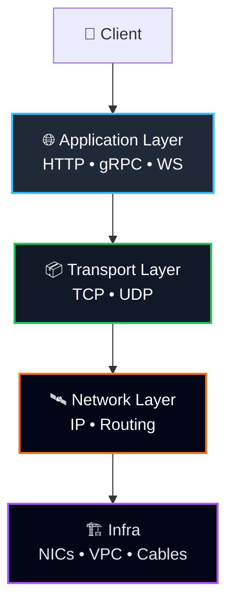

**Engineer note**
Failures propagate *upward*. Symptoms appear at L7, causes usually live below.

---

## 2. Layer 3 — IP and Routing (Weak by Design)

IP exists to solve **addressing and forwarding** at global scale. Everything else is explicitly out of scope.

### What IP Guarantees

* Each packet has a destination address
* Routers make a best-effort attempt to forward it

### What IP Refuses to Guarantee

* Delivery
* Order
* Duplication avoidance
* Timing

This is not a limitation — it is the reason the internet works.

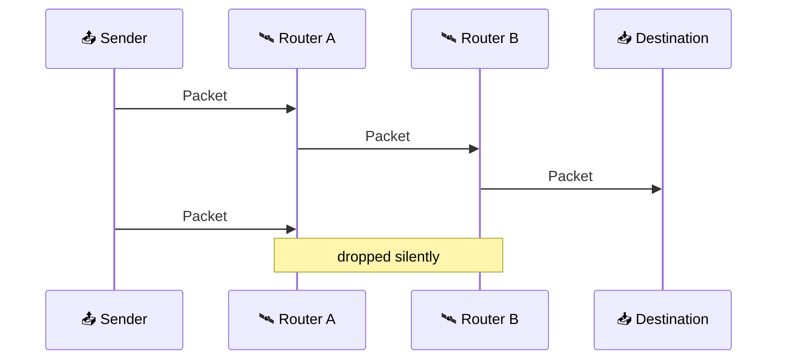

**Production implication**
If your system treats packet loss as exceptional, it will behave pathologically under load.

---

## 3. Layer 4 — Transport: Turning Loss into Semantics

Transport protocols exist to *simulate* properties that the network layer refuses to provide.

### TCP: Reliability via State and Backpressure

TCP converts loss into waiting.

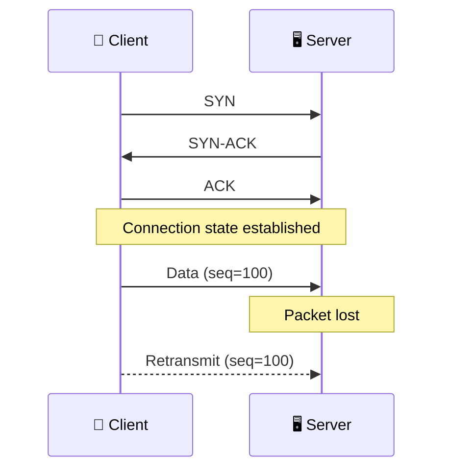

Properties:

* Ordered byte stream
* Retransmission
* Congestion control

Hidden cost:

> One missing packet can stall everything behind it.

This is why **tail latency explodes before throughput collapses**.

---

### UDP: Exposing Reality Directly

UDP removes transport-level illusions.

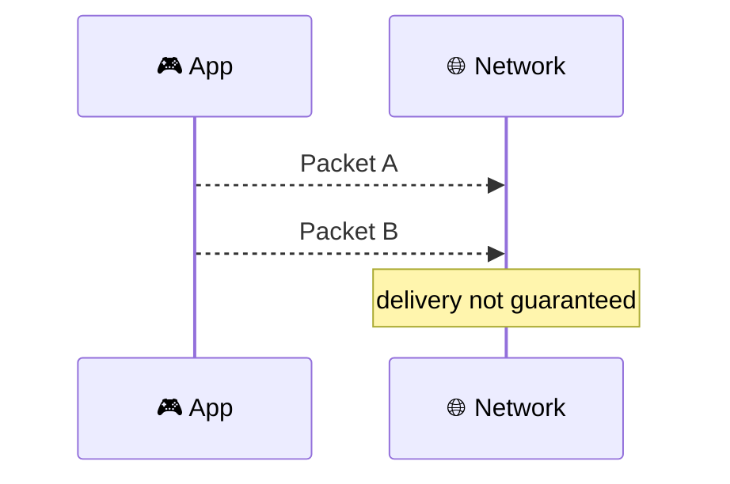

Use UDP only when:

* latency is more important than completeness
* the application understands loss

If you add retries, ordering, and congestion logic on top, you are rebuilding TCP — without decades of tuning.

---

## 4. Layer 7 — Application Protocols (Where Humans Interact)

This is the layer engineers think they control.

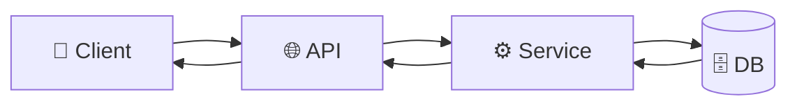

Failures at this layer present as:

* timeouts
* partial data
* retry amplification

Almost never as crashes.

---

## 5. API Styles and Operational Reality

### REST — Boring, Observable, Forgiving

REST aligns well with how failures actually happen:

* stateless requests
* independent retries
* cacheable responses

It survives because it degrades gracefully.

---

### gRPC — Tight Contracts, Tight Coupling

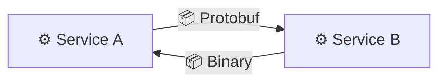

Benefits:

* explicit schemas
* efficient encoding
* streaming

Costs:

* harder debugging
* shared failure domains

**Engineer rule**
Use gRPC where teams share operational ownership.

---

## 6. Long‑Lived Connections and State Leakage

### WebSockets

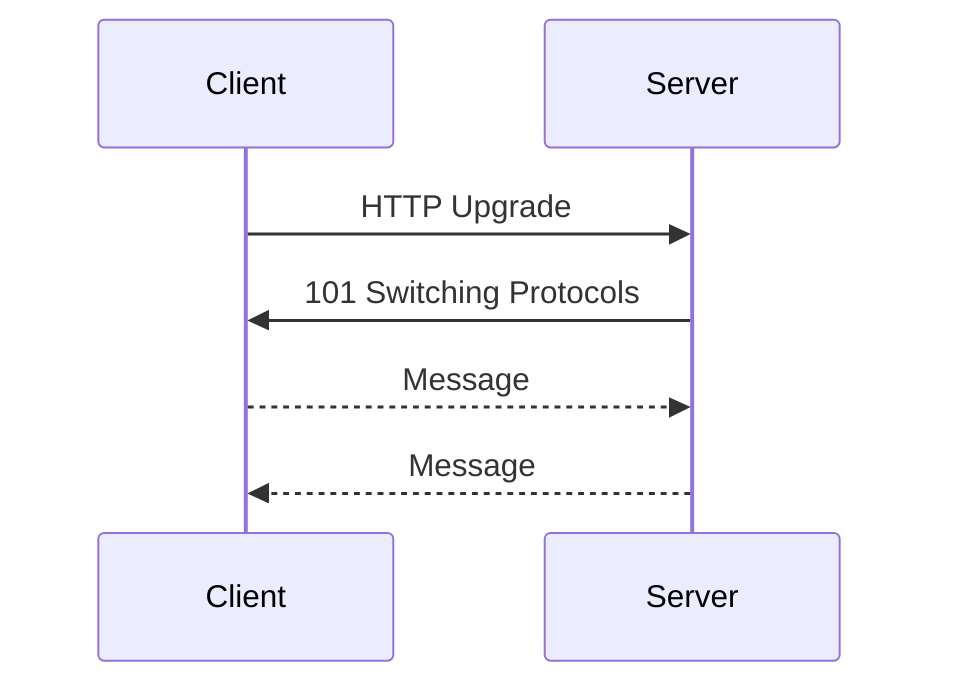

Each open connection consumes:

* memory
* file descriptors
* load balancer state

State scales linearly. Traffic rarely does.

---

## 7. Load Balancers: Concentrated Power

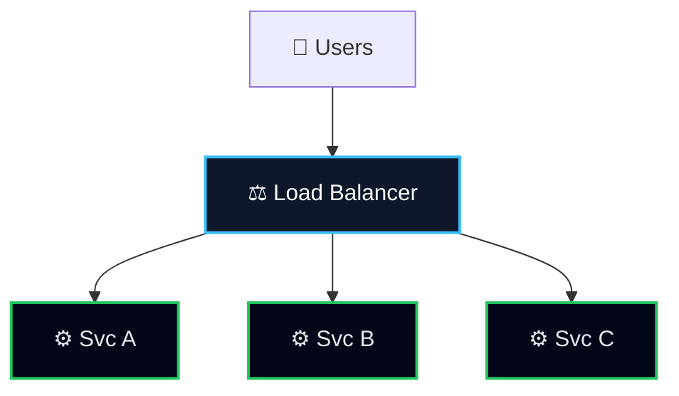

Load balancers:

* hide instance failure
* smooth traffic spikes
* introduce a new critical dependency

### L4 vs L7

| Type | Sees | Typical Failure           |
| ---- | ---- | ------------------------- |
| L4   | TCP  | resets, stuck connections |
| L7   | HTTP | misroutes, retry storms   |

---

## 8. Geography, Latency, and Physics

Facts that do not negotiate:

* distance adds latency
* cross-region calls fail more often

Design response:

* isolate regions
* replicate asynchronously
* cache aggressively

---

## 9. Failure Handling: Engineering Discipline

### Timeouts

Every network call must have a timeout. No exceptions.

A missing timeout is a **distributed resource leak**.

---

### Retries

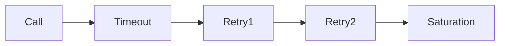

Rules:

* retry only idempotent operations
* exponential backoff
* jitter always

Most large outages are retry-driven.

---

### Circuit Breakers

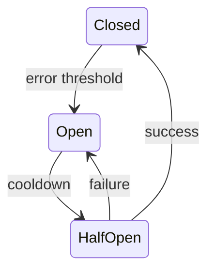

Circuit breakers do not prevent failure.
They prevent **failure propagation**.

---

## 10. Failure Timeline: How Real Incidents Unfold

Most outages do not start with a crash. They start with **latency drift**.

### A Typical Production Timeline

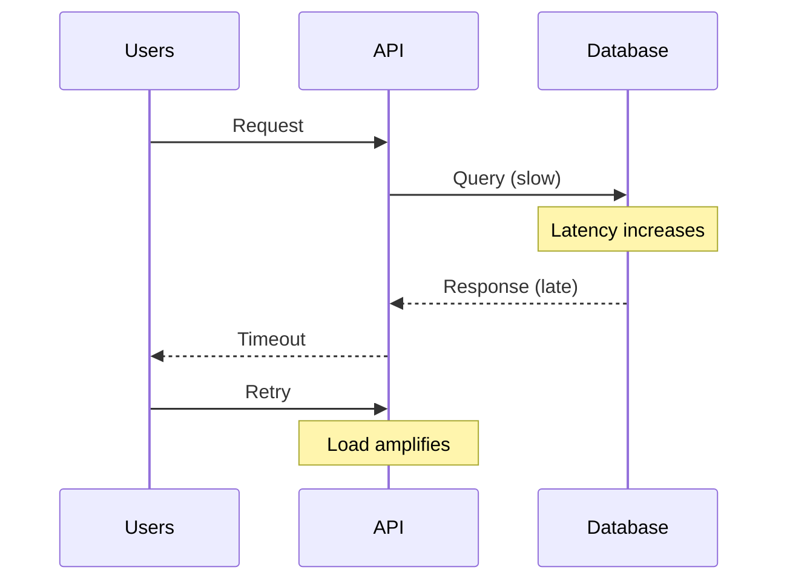

**What actually happened**:

* DB slowed slightly (not down)
* Timeouts triggered retries
* Retries increased load
* Latency cascaded into failure

The root cause was **not** the database. It was the retry policy.

---

## 11. Observability by Layer (What to Measure)

Good metrics align with layers.

| Layer | What to Measure     | Why                    |
| ----- | ------------------- | ---------------------- |
| L7    | Latency percentiles | User pain lives here   |
| L4    | Connection errors   | Detect saturation      |
| L3    | Packet loss         | Rare, but catastrophic |

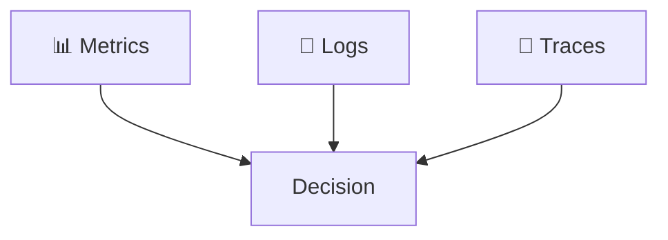

If you cannot explain an outage with these three, you are blind.

---

## 12. Design Checklist (Used Before Shipping)

Before introducing a network call, answer these:

* What is the timeout?
* Is the operation idempotent?
* What happens on partial failure?
* Where does backpressure appear?
* Can this retry amplify load?

If any answer is "we’ll see", the design is incomplete.

---

## 13. Vocabulary That Signals Seniority

Precision matters in incident reviews.

* **Latency vs Delay**: latency includes queuing
* **Failure vs Fault**: faults cause failures
* **Load vs Traffic**: load is resource pressure
* **Availability vs Reliability**: uptime vs correctness

Using these correctly changes conversations.

---

## Final Notes

* Networks fail quietly
* Latency hides before it hurts
* Defaults encode opinions you didn’t choose

This document is conservative because production systems punish optimism.
