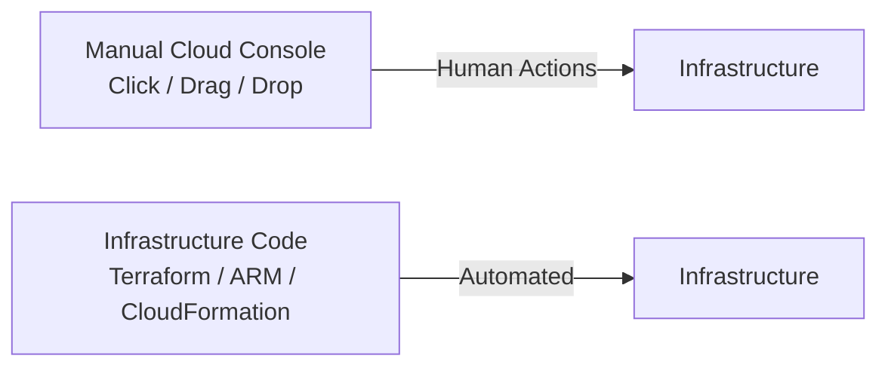
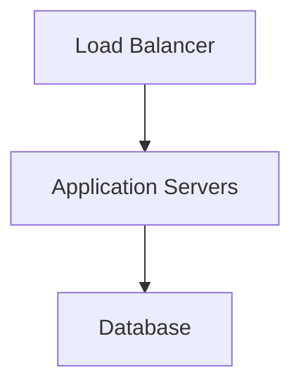
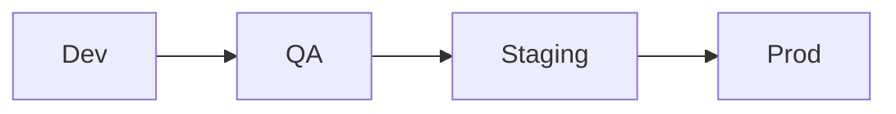
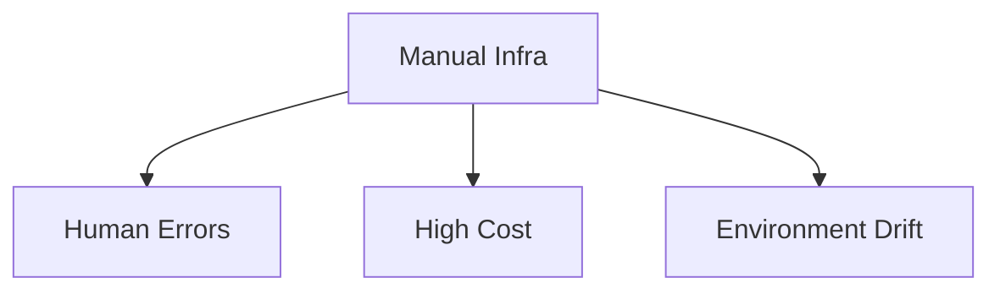
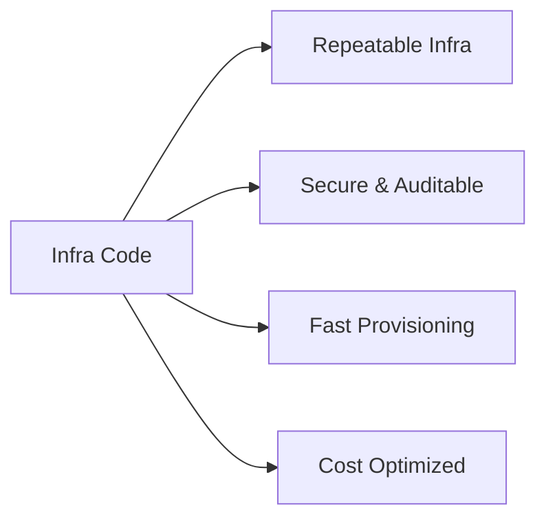

# Infrastructure as Code

## What is IaC?

**Infrastructure as Code (IaC)** means provisioning and managing infrastructure using **code**, instead of manually creating resources via a cloud console (clicks, drag & drop).

In IaC:

* Infrastructure is defined declaratively
* The same code can create, update, or destroy resources
* Infrastructure becomes repeatable and predictable

### Traditional vs IaC

---

## Why Do We Use Infrastructure as Code?

### "Why write code when we can just use the cloud console?"

Manual provisioning works fine for:

* Personal projects
* Learning or experiments

But it **does not scale**.

---

### Example: Three-Tier Application

Assume provisioning infra for:

* Load Balancer
* Application Servers
* Database

**Time taken manually:** ~2 hours

That’s acceptable for **one environment**.

---

### Multiple Environments Problem

In a company, you usually have:

* Dev
* QA
* Staging
* Production

Manual provisioning time:

| Environments | Time  |
| ------------ | ----- |
| 1            | 2 hrs |
| 4            | 8 hrs |

Now imagine:

* Hundreds of servers
* Multiple regions
* Multiple teams

Manual setup becomes:

* Slow
* Error-prone
* Hard to maintain

---

### Real-World Challenges Without IaC

❌ Hard to decommission infra → **High cloud cost**  
❌ Environments differ → *"Works on my machine"* issue  
❌ No easy rollback  
❌ No visibility into changes  
❌ Security & compliance risks  

---

## Benefits of Infrastructure as Code

### Key Advantages

* [x] Consistent environments across Dev / QA / Prod
* [x] Write once, deploy many (single codebase)
* [x] Faster provisioning
* [x] Reduced human error
* [x] Cost savings via automation
* [x] Version control (Git tracks infra changes)
* [x] Automated cleanup & scheduled destruction
* [x] Easy to create identical production-like environments
* [x] Developers can focus on application development

