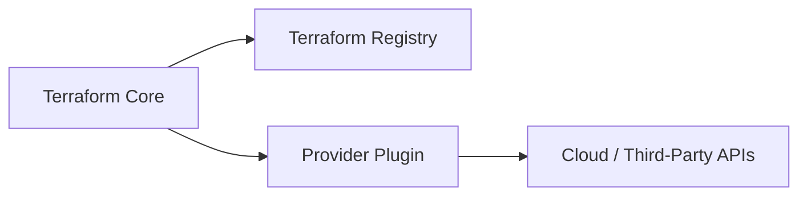

## What is a Terraform Provider?

A **Terraform provider** is a plugin that allows Terraform to interact with cloud platforms, SaaS services, or any third-party APIs to provision and manage infrastructure.

Providers are responsible for:
- Authenticating with the target platform
- Translating Terraform configurations into API calls
- Managing the lifecycle of resources (create, read, update, delete)

### High-level Architecture



---

## Terraform Core Version vs Provider Version

* **Terraform Core**

  * The Terraform CLI and engine
  * Handles state management, dependency graph, and execution plan

* **Provider**

  * Independent plugins maintained separately
  * Each provider has its own version lifecycle
  * Must be compatible with the Terraform Core version

> Terraform Core and Providers are versioned **independently**, but compatibility matters.

---

## Why Provider Version Matters

Using correct provider versions ensures:

* Stability and predictable behavior
* Access to new resources and features
* Bug fixes and security patches
* Avoidance of breaking changes

Problems caused by incorrect versions:

* Breaking schema changes
* Deprecated or removed resources
* Incompatible APIs
* Failed plans or applies

---

## Version Constraints in Terraform

Terraform allows you to restrict provider versions using **version constraints**.

### Common Version Operators

| Operator | Meaning                              |
| -------- | ------------------------------------ |
| `=`      | Exact version                        |
| `!=`     | Exclude a version                    |
| `>`      | Greater than                         |
| `>=`     | Greater than or equal                |
| `<`      | Less than                            |
| `<=`     | Less than or equal                   |
| `~>`     | Pessimistic constraint (recommended) |

### Example: Provider Version Constraint

```hcl
terraform {
  required_providers {
    aws = {
      source  = "hashicorp/aws"
      version = "~> 5.0"
    }
  }
}
```

🔹 `~> 5.0` allows:

* `5.0.x`, `5.1.x`, `5.9.x`
* ❌ Not `6.0.0`

---

## Best Practices

* Always pin provider versions
* Use `~>` for safe upgrades
* Lock versions using `terraform.lock.hcl`
* Test provider upgrades in non-production environments
* Track provider changelogs before upgrading