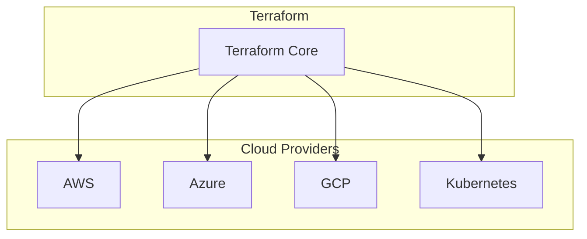
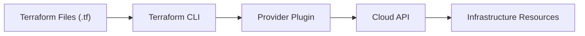
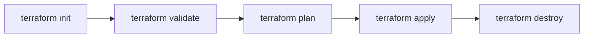

Here’s a **rewritten version** of your content using **default Mermaid diagrams** (no `architecture-beta`, no custom icons/logos), while keeping the structure clean and documentation-friendly.

---

## What is Terraform?

**Terraform** is an **Infrastructure as Code (IaC) tool** developed by **HashiCorp**.

It allows you to:

* Define infrastructure using **declarative configuration files**
* Provision resources across **multiple cloud platforms**
* **Create, update, and destroy** infrastructure safely and consistently

Terraform supports many providers, including:

* AWS
* Azure
* Google Cloud Platform (GCP)
* Kubernetes
* Various SaaS platforms

---

## Terraform Provider Ecosystem

Terraform Core uses **providers** as plugins to interact with different platforms and services.

---

## How Terraform Works

Terraform follows a simple workflow where **infrastructure is driven by code**.

Providers translate Terraform configurations into API calls that create or manage real infrastructure.

---

## Terraform Lifecycle Phases

Terraform operations follow a **well-defined execution lifecycle**.

---

### Phase Breakdown

* **init**
  Initializes the working directory and downloads required providers

* **validate**
  Checks configuration syntax and internal consistency

* **plan**
  Displays the execution plan showing what changes Terraform will make

* **apply**
  Creates or updates infrastructure resources

* **destroy**
  Safely removes all resources managed by Terraform

---

If you want, I can also:

* Convert this into **README.md** format
* Optimize Mermaid diagrams for **GitHub / GitLab rendering**
* Add **Terraform state & backend diagrams**
* Create a **Terraform vs CloudFormation** comparison section
